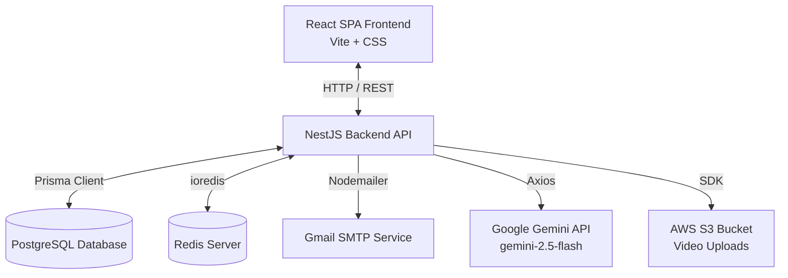
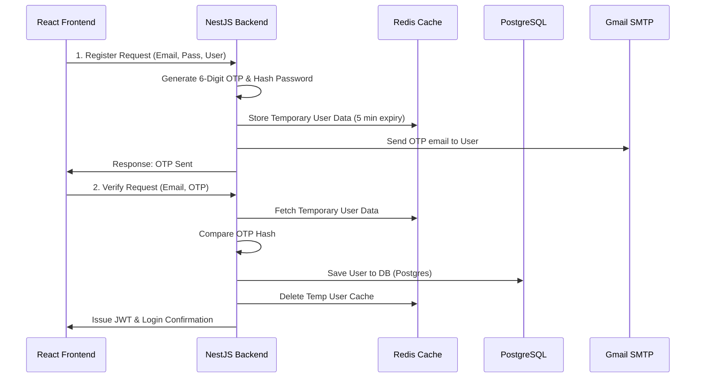

# 🚀 CrackCamp - Role-Based Interview Preparation Platform

Welcome to **CrackCamp**, an advanced role-based interview preparation platform designed to help aspiring software engineers, data analysts, cloud engineers, and cybersecurity professionals bridge the gap between academic theory and real-world hiring standards. 

CrackCamp guides users through structured role-specific learning paths, provides recommended reading and course materials, hosts an **Interactive Mock Interview Studio** with webcam/video upload capabilities, and embeds a **NestJS + Redis-cached AI Recruiter Chatbot** powered by Gemini.

---

## 🏗️ Architecture Overview

CrackCamp is built with a modern decoupled architecture consisting of a **React SPA frontend**, a **NestJS backend**, a **PostgreSQL relational database** for persistent data, and a **Redis in-memory store** for fast OTP processing and chatbot message caching.



---

## 🛠️ Technology Stack

### Frontend
- **Framework:** React 18+ (Vite)
- **Routing:** React Router DOM v6
- **HTTP Client:** Axios (interceptor config with baseURL)
- **Styling:** Vanilla CSS (Modern dark mode dashboard, glassmorphism, responsive grid layouts)
- **Multimedia:** HTML5 MediaDevices API (`getUserMedia` for webcam capture and recording)

### Backend
- **Framework:** NestJS (v11)
- **ORM:** Prisma Client (v7)
- **Database:** PostgreSQL (v15)
- **Cache & Temp Store:** Redis (v7)
- **Authentication:** Passport JWT, Bcrypt
- **Communications:** Nodemailer (SMTP for OTP mailing)
- **AI Integration:** Google Generative AI (Gemini 2.5 Flash) via HTTPS

### Deployment & DevOps
- **Containerization:** Docker & Docker Compose
- **Media Storage:** AWS S3 (pre-configured for uploading self-introduction videos)

---

## 📂 Project Directory Structure

```text
CrackCamp/
├── docker-compose.yml       # Orchestrates PostgreSQL, Redis, Backend, & Frontend
├── back-end/
│   ├── src/
│   │   ├── auth/            # JWT auth, Redis OTP signup flow, Gmail service
│   │   ├── chatbot/         # AI mentor chatbot service powered by Gemini
│   │   ├── dashboard/       # User profile & progress status controller
│   │   ├── resources/       # Skill metadata, OpenLibrary books & seeded tutorials
│   │   ├── self-intro/      # Video upload controllers & AWS S3 integration
│   │   ├── prisma/          # Prisma database service connection
│   │   ├── main.ts          # NestJS bootstrapper & global config
│   │   └── app.module.ts    # Main application module injection
│   ├── prisma/
│   │   ├── schema.prisma    # Prisma DB Schema definition (Postgres)
│   │   └── migrations/      # DB Schema migrations history
│   ├── Dockerfile           # Backend containerization rules
│   └── package.json         # Node dependencies
└── front-end/
    ├── src/
    │   ├── api/             # Axios instance config
    │   ├── components/      # Common components (Chatbot widget, ChatWindow)
    │   ├── pages/           # Page routes (Login, Register, Verify OTP, SelectRole, Dashboard, SelfIntro)
    │   ├── App.jsx          # Protected/Public routing rules
    │   ├── index.css        # Core styling sheet (Dark mode colors, grid structure)
    │   └── main.jsx         # React application entry point
    ├── Dockerfile           # Frontend static development build container
    └── package.json         # UI dependencies
```

---

## 🌟 Core Features & Flows

### 1. Secure Authentication & Redis OTP Registration
To prevent spam accounts and verify email addresses, CrackCamp utilizes a robust dual-stage signup process:



- **Temporary Store:** User password and credentials are not saved to the persistent database until the OTP is successfully validated. Redis stores this data (`register:${email}`) with a Time-To-Live (TTL) of 300 seconds.
- **Login:** Traditional login is verified via Bcrypt hashes against PostgreSQL, returning a standard JWT token.

### 2. Career Track Selection & Role-Specific Curriculum
Upon sign-up, users select one of the following career tracks:
- 💻 **Web Developer** (Skills: React, JavaScript, CSS, NodeJS, HTML)
- 📊 **Data Analyst** (Skills: Python, SQL, Tableau, Excel, Pandas)
- 📱 **Application Developer** (Skills: Flutter, React Native, Swift, Kotlin, Java)
- ☁️ **Cloud Engineer** (Skills: AWS, Docker, Kubernetes, Terraform, CI/CD)
- 🔒 **Cybersecurity Analyst** (Skills: Network Security, Linux, Penetration Testing, Cryptography, Wireshark)
- 🧠 **Machine Learning Engineer** (Skills: Python, TensorFlow, PyTorch, Scikit-Learn, Deep Learning)

### 3. Command Center (Dashboard)
The dashboard displays the core skills associated with the user's active career track. Clicking any skill fetches:
- 📖 **Recommended Reference Books:** Pulled dynamically on the frontend via the open-source **OpenLibrary Search API** (`https://openlibrary.org/search.json?q={skill}`).
- 📹 **Seeded Video Tutorials:** Served from the local PostgreSQL `ResourceTutorial` table containing pre-vetted video content (e.g., Free vs Paid courses).

### 4. Mock Interview Prep Studio
Located at `/self-intro`, this is the interactive simulation center where candidates record or upload their 60-second elevator pitches:
- **Webcam Interface:** Uses the browser's `MediaRecorder` API to record video stream chunks locally, preview the result, and save the file.
- **File Drag-and-Drop:** Built-in drag-and-drop zone supporting standard formats (`.webm`, `.mp4`, `.mov`).
- **Cloud Upload:** Submits files via multipart/form-data to the NestJS upload controller configured with an AWS S3 bucket destination (`crackcamp-selfintro-videos-kabi-001`).

### 5. AI Recruiter Chatbot
Embedded at the bottom-right of the dashboard and integrated fully into the Interview Prep page.
- **Gemini API:** Uses `gemini-2.5-flash` model to analyze student requests and simulated responses.
- **Role-based prompt:** The bot acts as **CrackCamp AI Mentor**, a calm technical coach guiding users through DSA, resume structure, behavioral STAR frameworks, and code optimization.
- **Redis Message Buffering:** To reduce PostgreSQL query load and keep chat speeds instantaneous, the chatbot caches the last 10 messages of the conversation in Redis (`chat:${conversationId}`). When a user queries, it pulls from Redis, appends new messages, trims the list to 10, and runs a background write to PostgreSQL for permanent message history.

---

## 🛠️ Getting Started & Running Locally

### Prerequisites
- [Docker & Docker Desktop](https://www.docker.com/) installed on your machine.
- Node.js (v18+) if you wish to run services manually outside containers.

### Configuration (`.env`)
The backend service expects environment variables. A pre-set list is provided in `docker-compose.yml` for local development. For production deployment, ensure these are configured securely:

| Environment Variable | Description |
|---|---|
| `DATABASE_URL` | PostgreSQL connection URL |
| `REDIS_HOST` | Hostname of the Redis server (`redis` in Docker, `localhost` locally) |
| `JWT_SECRET` | Secret token signing string for JWT authorization |
| `EMAIL_USER` / `EMAIL_PASS` | Gmail email & App password for sending OTP verification |
| `GEMINI_API_KEY` | Google Generative AI Developer key |
| `AWS_ACCESS_KEY_ID` / `AWS_SECRET_ACCESS_KEY` | AWS credentials for S3 uploads |
| `AWS_BUCKET_NAME` | AWS S3 Bucket Name for self-intro videos |

---

### Run using Docker Compose (Recommended)
This fires up PostgreSQL, Redis, NestJS, and React concurrently.

1. Navigate to the project root directory:
   ```bash
   cd CrackCamp
   ```
2. Build and run the containers:
   ```bash
   docker compose up --build
   ```
3. Once running:
   - **React Frontend:** Available at [http://localhost:5173](http://localhost:5173)
   - **NestJS Backend:** Available at [http://localhost:4000](http://localhost:4000)
   - **PostgreSQL:** Listening on port `5433` (externally)
   - **Redis:** Listening on port `6379` (externally)

---

### Running Manually for Development

If you prefer to run services in watch modes directly on your host machine:

#### 1. Databases (Postgres & Redis)
Ensure you start PostgreSQL (on port 5433 or update port in `.env` to 5432) and Redis (on port 6379).

#### 2. Start Backend API
```bash
cd back-end
npm install
npx prisma db push    # Syncs database schema with schema.prisma
npm run start:dev     # Starts backend with watch-reload enabled
```

#### 3. Start Frontend UI
```bash
cd front-end
npm install
npm run dev           # Starts Vite development server
```
Go to [http://localhost:5173](http://localhost:5173) in your browser.
